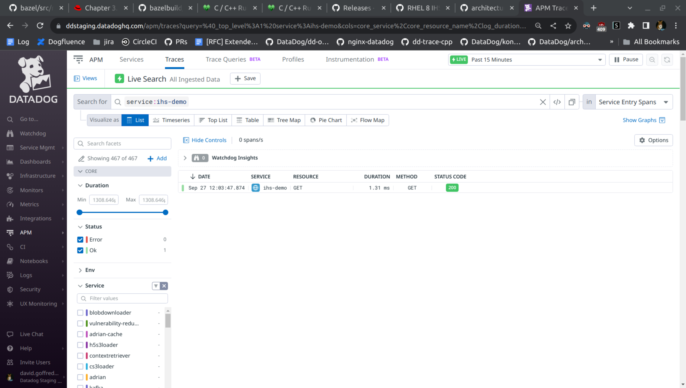
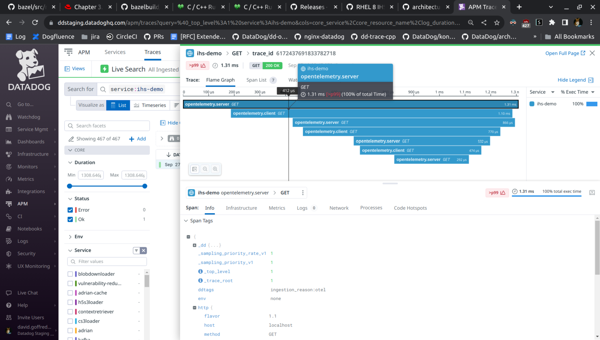

IHS on RHEL 8.8
===============
This directory contains build scripts that, together with modifications made to
bazel's `BUILD` and `WORKSPACE` files, allow this "otel.so" Apache module to be
built for compatibility IBM HTTP Server 9.0.5.16 running on Red Hat Enterprise
Linux 8.8 (Oopta).

This readme file contains:

- background and prerequisites
- build instructions for the module
- installation instructions for the module
- installation instructions for the IBM HTTP Server used
- installation instructions for the OpenTelemetry collector used (the Datadog
  agent)
- a description of the virtual machine used

Background
----------
[opentelemetry-cpp-contrib/instrumentation/httpd][1] is a module for [Apache
httpd][2] that adds distributed tracing using [OpenTelemetry][3]. The module
is built and tested on Ubuntu 18.04 and Ubuntu 20.04.

This directory is part of a port of that module. The port targets [IBM HTTP
Server 9.0.5][4], which is a derivative of Apache httpd, and Red Hat Enterprise
Linux 8.8, which is not Ubuntu.

Building the Module
-------------------
```console
$ bin/install-build-deps
$ bin/build-module
```
The bazel build's [WORKSPACE][5] refers to header files that are expected
already to be installed at `/opt/IBM/HTTPServer/include`, as would be the case
if IBM HTTP Server were installed on this machine. If not, then make those
headers available somewhere else and update the `WORKSPACE`. Note that
[mod_proxy.h][6] was instead copied from `/opt/IBM/HTTPServer/include` into
`src/` and modified -- it was including a header that is neither part of
the IBM HTTP Server installation nor a system header. If a version of IBM HTTP
Server other than 9.0.5 is to be used, then the corresponding header should be
again copied and modified. See the comments near the top of `mod_proxy.h` for a
description of the changes.

If the above `bin/*` scripts succeed, then the result will be a file `otel.so`
in [httpd/][1], i.e. in the directory `instrumentation/httpd` relative to this
repository's root.

Installing the Module
---------------------
This section assumes that IBM HTTP Server is installed on the production system
with the prefix `/opt/IBM/HTTPServer`.

Copy `otel.so` into `/opt/IBM/HTTPServer/modules`. The build places `otel.so`
into the following path relative to this repository's root:
`instrumentation/httpd/otel.so`.

Copy [otel.conf][7] into `/opt/IBM/HTTPServer/conf`. `otel.conf` loads the
module (`otel.so`) and contains OpenTelemetry-specific configuration directives.
See [httpd/README.md][8] for a description of those directives.

Add the following to `/opt/IBM/HTTPServer/conf/httpd.conf`:
```apache
# OpenTelemetry tracing
Include conf/otel.conf
```

Modify `/opt/IBM/HTTPServer/conf/httpd.conf`, if necessary, so that both the
`mod_proxy.so` and `mod_proxy_http.so` modules are loaded. A default
installation of IBM HTTP Server might have these lines commented out. Make sure
that they are not commented out:
```apache
LoadModule proxy_module modules/mod_proxy.so
LoadModule proxy_http_module modules/mod_proxy_http.so
```

Start (or restart) the server.
```console
$ sudo /opt/IBM/HTTPServer/bin/apachectl start
```

Installing the Datadog Agent
----------------------------
Once you have a Datadog API key (indicated by the placeholder "xxxx" below), the
Datadog Agent can be installed locally on the production machine via an online
installer script:
```console
$ DD_API_KEY=xxxx DD_SITE="datadoghq.com" bash -c "$(curl -L https://s3.amazonaws.com/dd-agent/scripts/install_script_agent7.sh)"
```
Alternatively, the Datadog Agent can be installed on another host, and the
OpenTelemetry module can be configured to connect to it.

In either case, the following part of `/etc/datadog-agent/datadog.yaml` needs to be uncommented (enabled) wherever the Datadog Agent is installed. It instructs the agent to listen for OTLP/gRPC on port 4317:
```yaml
## This section configures OTLP ingest in the Datadog Agent.
#
otlp_config:

  ## @param receiver - custom object - optional
  ## The receiver configuration. It follows the OpenTelemetry Collector's OTLP Receiver Configuration.
  ## This template lists the most commonly used settings; see the OpenTelemetry Collector documentation
  ## for a full list of available settings:
  ## https://github.com/open-telemetry/opentelemetry-collector/blob/main/receiver/otlpreceiver/config.md
  #
  receiver:

    ## @param protocols - custom object - optional
    ## Configuration for the supported protocols.
    #
    protocols:

        ## @param grpc - custom object - optional
        ## Configuration for OTLP/gRPC listener.
        ## Setting this as an empty section enables the OTLP/gRPC listener with default options.
        #
        grpc:

          ## @param endpoint - string - optional - default: 0.0.0.0:4317
          ## @env DD_OTLP_CONFIG_RECEIVER_PROTOCOLS_GRPC_ENDPOINT - string - optional - default: 0.0.0.0:4317
          ## The OTLP/gRPC listener endpoint.
          #
          endpoint: 0.0.0.0:4317

          ## @param transport - string - optional - default: tcp
          ## @env DD_OTLP_CONFIG_RECEIVER_PROTOCOLS_GRPC_TRANSPORT - string - optional - default: tcp
          ## The OTLP/gRPC listener transport protocol.
          ## Known protocols are "tcp", "udp", "ip", "unix", "unixgram", and "unixpacket".
          #
          transport: tcp
```
If the Datadog Agent is installed on the same host as IBM HTTP Server, then
"0.0.0.0" can be replaced by "127.0.0.1".

In the OpenTelemetry module, the `OpenTelemetryEndpoint` directive is used to
configure how to connect to the collector (in this case, the Datadog Agent).
See [otel.conf][7].

Example: Build, Install, and Demo
---------------------------------
This example will build and install the module on the same machine. In a real
production environment, it's more likely that the built `otel.so` and config
`otel.conf` would be separately deployed to the IHS installation.

```console
[david@rhel8 httpd]$ pwd
/home/david/src/opentelemetry-cpp-contrib/instrumentation/httpd/ihs/rhel8

[david@rhel8 rhel8]$ bin/install-build-deps
@ECHO@ line 5: set -e
@ECHO@ line 7: sudo yum group install -y 'Development Tools'
[sudo] password for david:
Updating Subscription Management repositories.
... lots of output ...

[david@rhel8 rhel8]$ bin/build-module
@ECHO@ line 5: set -e
@@ECHO@ line 8: dirname bin/build-module
@ECHO@ line 8: bin=bin
@ECHO@ line 9: cd bin/../../../
@ECHO@ line 30: bazelisk build --nostart_end_lib --verbose_failures --subcommands -c opt :all
INFO: Analyzed target //:otel.so (51 packages loaded, 3062 targets configured).
INFO: Found 1 target...
... lots of output ...
@ECHO@ line 35: ihs/rhel8/bin/transform-params
@ECHO@ line 35: tr '\n' '\0'
@ECHO@ line 35: xargs -0 g++

[david@rhel8 rhel8]$ sudo cp otel.conf /opt/IBM/HTTPServer/conf
[sudo] password for david:

[david@rhel8 rhel8]$ sudo cp ../../otel.so /opt/IBM/HTTPServer/modules

[david@rhel8 rhel8]$ sudo tee --append /opt/IBM/HTTPServer/conf/httpd.conf <<'END_CONF'
> # OpenTelemetry tracing
> Include conf/otel.conf
>
> # Reverse proxy to a traced upstream (which is just us again).
> <Location "/self">
>   ProxyPass "http://localhost"
>   ProxyPassReverse "http://localhost"
> </Location>
>
> END_CONF
[sudo] password for david:
...

[david@rhel8 rhel8]$ sudo /opt/IBM/HTTPServer/bin/apachectl restart

[david@rhel8 rhel8]$ curl 'http://localhost/self/self/self'
<!DOCTYPE HTML PUBLIC "-//W3C//DTD HTML 4//EN">
...
```
In `/opt/IBM/HTTPServer/logs/access_log`, I see:
```
::1 - - [27/Sep/2023:12:03:47 -0400] "GET / HTTP/1.1" 200 2069 244 "-" (core.c/0/handler) MS=0 +
::1 - - [27/Sep/2023:12:03:47 -0400] "GET /self HTTP/1.1" 200 2069 551 "-" (mod_proxy.c/0/handler) MS=0 +
::1 - - [27/Sep/2023:12:03:47 -0400] "GET /self/self HTTP/1.1" 200 2069 867 "-" (mod_proxy.c/0/handler) MS=0 +
::1 - - [27/Sep/2023:12:03:47 -0400] "GET /self/self/self HTTP/1.1" 200 2069 1408 "-" (mod_proxy.c/0/handler) MS=1 +
```

A few seconds later, in the Datadog UI under `APM > Traces`, I search for
`service:ihs-demo` and find:



Clicking on the result shows a trace that includes four passes through IHS: one for each line in the access log, above:



Appendix: Installing the IBM HTTP Server
----------------------------------------
To install IHS, first you must install the IBM Installation Manager. With IBM
credentials in hand, download the installer from IBM's website.

Here is one possible link stack:

- https://www.ibm.com/docs/en/installation-manager/1.9.2
    - https://www.ibm.com/support/pages/installation-manager-and-packaging-utility-download-documents
        - https://www.ibm.com/support/pages/node/7014705
            - https://www.ibm.com/support/pages/node/7014705#DNLD
                - https://www.ibm.com/support/fixcentral/swg/selectFixes?parent=ibm%7ERational&product=ibm/Rational/IBM+Installation+Manager&release=1.9.2.5&platform=Linux&function=all&useReleaseAsTarget=true
                    - https://ak-delivery04-mul.dhe.ibm.com/sdfdl/v2/sar/CM/RA/0bk9x/0/Xa.2/Xb.jusyLTSp44S03Y3J_Ad6H9qN54cIwilBSqXUkcyyQnaGma-UAIW4R0gEE7M/Xc.CM/RA/0bk9x/0/agent.installer.linux.gtk.x86_64_1.9.2005.20230718_1844.zip/Xd./Xf.LPR.D1VC/Xg.12472699/Xi.habanero/XY.habanero/XZ.AnLnlUjMId8chauiwWLHjyhD_9tBDLny/agent.installer.linux.gtk.x86_64_1.9.2005.20230718_1844.zip

Unzip the installer and `cd` into it. The command line interface for the
installer is `tools/imcl`.

In addition to IHS, v8 of the JDK must also be installed.
```console
[david@rhel8 agent.installer]$ sudo tools/imcl install com.ibm.java.jdk.v8 com.ibm.websphere.IHS.v90_9.0.5016.20230609_0954 -repositories http://www.ibm.com/software/repositorymanager/com.ibm.websphere.IHS.v90 -prompt -acceptLicense
Enter the master password to unlock credentials storage:
Installed com.ibm.websphere.IHS.v90_9.0.5016.20230609_0954 to the /opt/IBM/HTTPServer directory.
Installed com.ibm.java.jdk.v8_8.0.8010.20230912_0655 to the /opt/IBM/HTTPServer directory.
...
```
IHS is now installed at the prefix `/opt/IBM/HTTPServer`.
```console
[david@rhel8 rhel8]$ sudo /opt/IBM/HTTPServer/bin/apachectl -V
[sudo] password for david:
Server version: IBM_HTTP_Server/9.0.5.16 (Unix)
Apache version: 2.4.12 (with additional fixes)
Server built:   Apr 14 2023 10:50:27
Build level:    gihs90/9.0.5.16
Server's Module Magic Number: 20120211:57
Server loaded:  APR 1.5.1, APR-UTIL 1.5.2
Compiled using: APR 1.5.1, APR-UTIL 1.5.2
Architecture:   64-bit
Operating System: Linux x86_64
...
```

Appendix: Setting up a Red Hat Enterprise Linux 8.8 VM
------------------------------------------------------
This port of the OpenTelemetry Apache module was developed and tested in an RHEL
8.8 virtual machine running on KVM.

The installation media was RHEL's 8.8's "DVD ISO" image downloaded from Red
Hat's [website][9] ([download][10]).

This is the one:
```
Red Hat RHEL 8.8

File name: rhel-8.8-x86_64-dvd.iso
File Size: 11.7 GB
SHA-256 Checksum: 517abcc67ee3b7212f57e180f5d30be3e8269e7a99e127a3399b7935c7e00a09
Last Updated: 2023-04-26
```

The system was installed with an admin user ("david") and a root password.

To enable Red Hat's package repositories, register the system using the `subscription-manager`:
```console
$ subscription-manager register --username <REDACTED> --password <REDACTED> --auto-attach
```

`subscription-manager` accepts the same credentials as the Red Hat website.

Then package repositories can be updated:
```console
$ sudo yum update -y
```

Here is the precise Linux:
```console
[david@rhel8 ~]$ uname -a
Linux rhel8 4.18.0-477.27.1.el8_8.x86_64 #1 SMP Thu Aug 31 10:29:22 EDT 2023 x86_64 x86_64 x86_64 GNU/Linux
[david@rhel8 ~]$ cat /etc/os-release
NAME="Red Hat Enterprise Linux"
VERSION="8.8 (Ootpa)"
ID="rhel"
ID_LIKE="fedora"
VERSION_ID="8.8"
PLATFORM_ID="platform:el8"
PRETTY_NAME="Red Hat Enterprise Linux 8.8 (Ootpa)"
ANSI_COLOR="0;31"
CPE_NAME="cpe:/o:redhat:enterprise_linux:8::baseos"
HOME_URL="https://www.redhat.com/"
DOCUMENTATION_URL="https://access.redhat.com/documentation/en-us/red_hat_enterprise_linux/8"
BUG_REPORT_URL="https://bugzilla.redhat.com/"

REDHAT_BUGZILLA_PRODUCT="Red Hat Enterprise Linux 8"
REDHAT_BUGZILLA_PRODUCT_VERSION=8.8
REDHAT_SUPPORT_PRODUCT="Red Hat Enterprise Linux"
REDHAT_SUPPORT_PRODUCT_VERSION="8.8"
```

[1]: ../../
[2]: https://httpd.apache.org/
[3]: https://github.com/open-telemetry/opentelemetry-cpp
[4]: https://www.ibm.com/docs/en/ibm-http-server/9.0.5
[5]: ../../WORKSPACE
[6]: ../../src/mod_proxy.h
[7]: otel.conf
[8]: ../../README.md
[9]: https://access.redhat.com/downloads/content/rhel
[10]: https://access.cdn.redhat.com/content/origin/files/sha256/51/517abcc67ee3b7212f57e180f5d30be3e8269e7a99e127a3399b7935c7e00a09/rhel-8.8-x86_64-dvd.iso?user=b5dd664b5d63481b92df46505a41de59&_auth_=1693953132_7f2ceec0f50d6d4857bb25eae79b3f71
